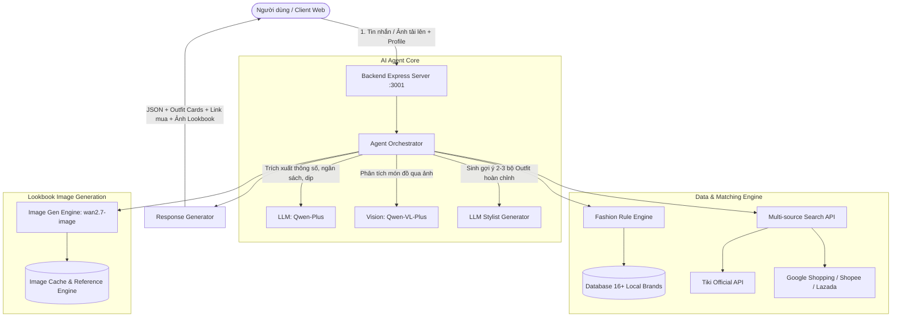

# 👗 Fashion AI Agent - Trợ Lý Phối Đồ & Tìm Kiếm Thời Trang Thông Minh

> **Fashion AI** là một hệ thống AI Agent chuyên sâu trong lĩnh vực thời trang và bán lẻ thông minh. Dự án kết hợp công nghệ **Mô hình ngôn ngữ lớn (LLM)**, **Thị giác máy tính (Computer Vision)**, **Công nghệ sinh ảnh đa phương thức (Multimodal Image Gen)** và **Bộ máy lọc luật phối đồ (Fashion Rule Engine)** để giải quyết triệt để bài toán: *"Hôm nay mặc gì vừa đẹp, vừa vừa vặn theo vóc dáng, lại đúng ngân sách và mua được ngay tại Việt Nam?"*

---

## 📌 Mục Lục
1. [Tổng Quan Dự Án](#-tổng-quan-dự-án)
2. [Kiến Trúc Hệ Thống](#-kiến-trúc-hệ-thống)
3. [Các Tính Năng Nổi Bật](#-các-tính-năng-nổi-bật)
4. [Bộ Máy Phối Đồ Thông Minh (Fashion Rule Engine)](#-bộ-máy-phối-đồ-thông-minh-fashion-rule-engine)
5. [Cơ Chế Tìm Kiếm & Dữ Liệu Sản Phẩm](#-cơ-chế-tìm-kiếm--dữ-liệu-sản-phẩm)
6. [Công Nghệ Sử Dụng (Tech Stack)](#-công-nghệ-sử-dụng-tech-stack)
7. [Cấu Trúc Thư Mục](#-cấu-trúc-thư-mục)
8. [Hướng Dẫn Cài Đặt & Chạy Thử Nghiệm](#-hướng-dẫn-cài-đặt--chạy-thử-nghiệm)
9. [Đóng Gói Chuẩn Marketplace](#-đóng-gói-chuẩn-marketplace)
10. [Lưu Ý Về Triển Khai & Git](#-lưu-ý-về-triển-khai--git)

---

## 🌟 Tổng Quan Dự Án

Khác với các chatbot AI thông thường chỉ tư vấn lý thuyết chung chung, **Fashion AI Agent** là một tác tử thông minh có khả năng hành động và kết nối dữ liệu thực tế:
- **Tư vấn may đo theo vóc dáng**: Tính toán kích thước (Áo, Quần, Giày) dựa trên chiều cao, cân nặng, giới tính và dáng người.
- **Phối nguyên set đồ (Mix & Match)**: Phân bổ ngân sách chi tiết từng món đồ (áo, quần, giày, phụ kiện).
- **Tìm sản phẩm thực có thể mua ngay**: Tích hợp cơ sở dữ liệu từ 16+ thương hiệu thời trang Việt Nam và các sàn thương mại điện tử (Shopee, Lazada, Tiki).
- **Tạo ảnh Lookbook người mẫu trực quan**: Dùng AI để sinh hình ảnh người mẫu mang đúng dáng dấp của người dùng, mặc trọn vẹn set đồ được đề xuất trước khi mua sắm.
- **Phối đồ từ ảnh tủ đồ cá nhân**: Chụp ảnh món đồ đang có, AI sẽ phân tích màu sắc, kiểu dáng và gợi ý các món đồ mới để phối cùng.

---

## 🏗 Kiến Trúc Hệ Thống



### Luồng Xử Lý 5 Bước (Pipeline)
1. **Phân tích yêu cầu (Natural Language Understanding)**: Trích xuất chính xác ngân sách, phong cách (*streetwear, casual, minimalist, formal, vintage...*), dịp mặc (*đi làm, đi chơi, hẹn hò, du lịch...*), số đo vóc dáng.
2. **Lập chiến lược Outfit (Styling Strategy)**: Định hình 2 - 3 set đồ cân đối, chia ngân sách khoa học (ví dụ: áo 250k, quần 400k, giày 500k), tính size áo, quần, giày chuẩn form người Việt.
3. **Truy vấn & Chấm điểm sản phẩm (Product Matching)**: Chạy qua bộ lọc luật chấm điểm đa tiêu chí (màu sắc, chất liệu mùa vụ, thương hiệu, mức giá).
4. **Sinh hình ảnh Lookbook chân thực (Multimodal Image Gen)**: Ghép ảnh sản phẩm và đặc điểm nhân khẩu học của người dùng, gọi model `wan2.7-image` để sinh ảnh minh họa người mẫu mặc set đồ hoàn chỉnh.
5. **Trình bày trực quan (Interactive Presentation)**: Trả về giao diện thẻ Outfit Card kèm giá, nút so sánh giá, gắn cờ vượt ngân sách và liên kết mua hàng trực tiếp.

---

## 🚀 Các Tính Năng Nổi Bật

### 1. Phối Đồ Toàn Diện (Mix & Match)
- Tạo ra 2-3 phối đồ hoàn chỉnh từ đầu đến chân: **Top** (Áo/Sơ mi/Polo), **Bottom** (Quần âu/Jean/Shorts/Váy), **Shoes** (Giày/Sneaker), **Accessories** (Túi/Thắt lưng/Mũ).
- Tự động cân đối tổng chi phí của cả bộ sao cho **không vượt quá ngân sách** người dùng yêu cầu.

### 2. Tư Vấn Form Dáng & Size Đồ (Size Recommendation)
- Tự động nhận diện tỷ lệ cơ thể dựa trên số đo chiều cao & cân nặng.
- Đề xuất size chi tiết:
  - Áo: S, M, L, XL, XXL...
  - Quần: 28, 29, 30, 31, 32...
  - Giày: 39, 40, 41, 42, 43...

### 3. Phối Đồ Từ Ảnh Có Sẵn (Wardrobe Match / Vision AI)
- Người dùng chỉ cần tải lên ảnh một chiếc áo, quần hoặc đôi giày có sẵn trong tủ.
- Mô hình **Qwen-VL-Plus** phân tích màu sắc, chất liệu, hoa văn và form dáng món đồ.
- Agent tự động giữ nguyên món đồ hiện có (`is_existing = true`) và tìm kiếm thêm các món đồ mới còn thiếu để tạo nên set đồ hoàn hảo.

### 4. Tạo Ảnh Người Mẫu Thực Tế (AI Virtual Lookbook)
- Không dùng ảnh stock giả tạo: Tích hợp công nghệ sinh ảnh **DashScope Multimodal Generation (`wan2.7-image` / `qwen-image-2.0`)**.
- Hỗ trợ truyền tối đa **9 ảnh tham chiếu** (ảnh các sản phẩm thật từ giỏ hàng + ảnh chân dung/dáng của người dùng).
- Khắc họa người mẫu với đúng chiều cao, cân nặng, giới tính và diện đúng các món đồ được chọn.

### 5. So Sánh Giá & Tìm Nơi Bán Rẻ Nhất (Price Comparison)
- Bảng so sánh đa nền tảng tích hợp ngay trong giao diện.
- Hiển thị nhãn **Rẻ nhất**, nhận diện tình trạng hết hàng hoặc vượt ngân sách (`overBudget`).
- Dẫn link trực tiếp đến trang sản phẩm thật, tuyệt đối không tạo link tìm kiếm chung chung để tránh bị chặn bot/captcha.

### 6. Hồ Sơ Cá Nhân & Tủ Đồ Yêu Thích (Profile & Favorites)
- Cho phép người dùng lưu trữ số đo, giới tính và ảnh cá nhân vào Local Storage.
- Bộ sưu tập các set đồ ưng ý (Favorites) lưu lại để xem lại và mua sắm sau.

---

## 🧠 Bộ Máy Phối Đồ Thông Minh (Fashion Rule Engine)

Hệ thống sở hữu một Rule Engine độc lập giúp đảm bảo tính thẩm mỹ và độ tương thích thực tế của trang phục:

### 1. Quy tắc phối màu (Color Harmony)
Ma trận phối màu tự động xác định các gam màu tương hợp, bổ trợ hoặc tương phản tinh tế:
- **Trắng / Đen**: Phối hợp linh hoạt với hầu hết các gam màu (*navy, gray, beige, red, khaki...*).
- **Navy**: Hợp với *white, beige, gray, brown, khaki, blue*.
- **Beige / Khaki**: Hợp với *navy, white, brown, black, green*.

### 2. Quy tắc thời tiết & chất liệu theo mùa (Season-Material Rules)
- **Mùa hè (Summer)**: Ưu tiên chất liệu *cotton, linen, vải lanh, bamboo, coolmax, mesh*; chuộng *t-shirt, polo, shorts, đầm*; hạn chế áo khoác dày, blazer.
- **Mùa đông (Winter)**: Ưu tiên *wool (len), fleece (nỉ), vải dạ, lông cừu*; chuộng *jacket, blazer, cardigan, hoodie*; loại trừ quần shorts.
- **Mùa thu / xuân**: Ưu tiên *denim, khaki, vải dệt kim nhẹ, sơ mi oxford*.

### 3. Độ tương thích thương hiệu & Phong cách (Style-Brand Affinity)
Hệ thống tính điểm liên kết giữa gu thời trang của người dùng với các thương hiệu nổi tiếng tại Việt Nam:
| Phong cách | Thương hiệu ưu tiên hàng đầu |
| :--- | :--- |
| **Minimalist** | Uniqlo, Libé, The Blue T-shirt, Routine |
| **Basic / Casual** | Coolmate, Uniqlo, Couple TX, Routine, Torano |
| **Formal / Công sở** | Routine, Aristino, Eva de Eva, Torano, Marc |
| **Streetwear** | Dirty Coins, Davies, Teelab |
| **Sporty** | Coolmate, Biti's, Uniqlo |
| **Korean / Điệu đà** | Marc, OLV, Libé, Routine, Eva de Eva |
| **Vintage / Cổ điển** | OLV, Libé, Routine, Davies |

### 4. Công thức chấm điểm sản phẩm (Multi-factor Scoring)
Mỗi sản phẩm khi tìm kiếm được chấm điểm độ tương đồng dựa trên trọng số chuẩn xác:
$$\text{Score} = 0.25 \times \text{Budget} + 0.20 \times \text{Category} + 0.20 \times \text{Style} + 0.15 \times \text{Gender} + 0.10 \times \text{Season} + 0.05 \times \text{Brand} + 0.05 \times \text{Color}$$

---

## 🛍 Cơ Chế Tìm Kiếm & Dữ Liệu Sản Phẩm

### 1. Cơ sở dữ liệu nội bộ (Scraped Database)
Hệ thống tích hợp sẵn module tự động cào dữ liệu (`scraper.js`) định kỳ 3 ngày/lần từ các nền tảng thương mại điện tử Haravan, Sapo và các API thương hiệu:
- **Thương hiệu Nam & Unisex**: *Uniqlo, Routine, Coolmate, Biti's, Dirty Coins, Torano, Aristino, Teelab, Davies, Couple TX*.
- **Thương hiệu Nữ**: *Marc, Eva de Eva, Libé, OLV, The Blue T-shirt, Coco Sin*.

### 2. Tìm kiếm Live Marketplace
- **Tiki Open API**: Gọi API trực tiếp không cần API key để lấy thông tin sản phẩm, thumbnail và giá cập nhật theo thời gian thực.
- **Google Shopping Search (Serper.dev)**: Tìm kiếm sản phẩm thực tế trên Shopee.vn và Lazada.vn khi có `SERPER_API_KEY`.
- **Cơ chế Fallback thông minh**: Tự động chuyển hướng và lọc URL hợp lệ, đảm bảo người dùng luôn nhận được link sản phẩm chính xác.

---

## 💻 Công Nghệ Sử Dụng (Tech Stack)

### Backend
- **Runtime**: Node.js (ES Modules)
- **Framework**: Express.js
- **File Upload**: Multer (Memory Storage)
- **AI Integrations**:
  - OpenAI SDK kết nối **Alibaba Cloud DashScope API**
  - Text/Reasoning: `qwen-plus`
  - Vision/Image-to-Text: `qwen-vl-plus`
  - Text-to-Image / Multimodal Image Gen: `wan2.7-image` (fallback `qwen-image-2.0`)
- **Web Scraping & Search**: Native Fetch, AbortSignal timeout, Cheerio / JSON Endpoints

### Frontend
- **Framework**: React 18
- **Build Tool**: Vite
- **Styling**: Vanilla Modern CSS (Design Tokens, Glassmorphism, Responsive, Dark/Light Mode accents)
- **State Management**: React Hooks + LocalStorage Persistence

### Đóng Gói Phân Phối
- **Allard Agent Marketplace v1alpha3 Specification**:
  - `agent.yaml`: Manifest đặc tả quyền hạn (`permissions`), dữ liệu (`data retention`), thông tin sản phẩm.
  - `LISTING.md` & `GUIDE.md`: Hồ sơ niêm yết và tài liệu hướng dẫn chuẩn độ dài.
  - Script build đóng gói tự động: `build_marketplace_package.py`.

---

## 📁 Cấu Trúc Thư Mục

```text
clothesSearch/
├── client/                           # Giao diện Frontend React + Vite
│   ├── src/
│   │   ├── components/
│   │   │   ├── ChatInterface.jsx     # Khung chat tương tác chính
│   │   │   ├── OutfitCard.jsx        # Thẻ hiển thị bộ outfit + Lookbook AI
│   │   │   ├── ProductItem.jsx       # Thẻ chi tiết sản phẩm + link mua
│   │   │   ├── PriceCompareModal.jsx # Modal so sánh giá đa sàn
│   │   │   ├── ProfileModal.jsx      # Modal cài đặt số đo vóc dáng cá nhân
│   │   │   ├── FavoritesPanel.jsx    # Bảng danh sách set đồ đã lưu
│   │   │   └── WelcomeScreen.jsx     # Màn hình chào & câu hỏi mẫu
│   │   ├── services/
│   │   │   ├── api.js                # Kết nối HTTP API backend
│   │   │   └── profile.js            # Quản lý số đo & profile người dùng
│   │   ├── App.jsx                   # Component gốc ứng dụng
│   │   └── index.css                 # Hệ thống CSS Design System
│   └── package.json
│
├── server/                           # Dịch vụ Backend & Agent Engine
│   ├── data/                         # CSDL JSON sản phẩm đã cào (16+ brands)
│   ├── src/
│   │   ├── agent/
│   │   │   ├── core.js               # Logic điều phối chính của Agent
│   │   │   ├── prompts/
│   │   │   │   └── searchPrompt.js   # Bộ System Prompts (Parse, Outfit, Vision)
│   │   │   └── tools/
│   │   │       ├── catalogSearch.js  # Rule Engine chấm điểm & phối màu/chất liệu
│   │   │       ├── imageGen.js       # Bộ sinh ảnh người mẫu (wan2.7-image)
│   │   │       ├── scraper.js        # Crawler 16 thương hiệu thời trang Việt
│   │   │       └── webSearch.js      # Tìm kiếm sản phẩm Tiki, Shopee, Lazada
│   │   ├── config/
│   │   │   └── env.js                # Biến môi trường & cấu hình API Client
│   │   ├── db/
│   │   │   └── productDB.js          # In-memory Database & nạp dữ liệu JSON
│   │   ├── routes/
│   │   │   └── searchRoutes.js       # Các API Endpoints (/chat, /image, /scrape...)
│   │   └── index.js                  # Khởi chạy Express Server
│   └── package.json
│
├── marketplace_package/              # Thư mục đóng gói Agent lên sàn phân phối
│   ├── agent.yaml                    # Khai báo Agent Manifest v1alpha3
│   ├── LISTING.md                    # Bản mô tả tóm tắt giới thiệu sản phẩm
│   ├── GUIDE.md                      # Hướng dẫn chi tiết sử dụng Agent
│   └── assets/                       # Icon chuẩn 512x512 RGBA & hình ảnh
│
├── build_marketplace_package.py      # Script đóng gói gói cài đặt Agent tự động
├── docker-compose.yml                # Cấu hình triển khai Docker container
└── package.json                      # Cấu hình scripts cấp root
```

---

## 🛠 Hướng Dẫn Cài Đặt & Chạy Thử Nghiệm

### 1. Chuẩn bị môi trường
- **Node.js**: Phiên bản 18+ trở lên.
- **Python**: 3.9+ (nếu cần chạy đóng gói marketplace package).
- Các API Keys:
  - `DASHSCOPE_API_KEY`: API Key của Alibaba Cloud DashScope (bắt buộc cho LLM, Vision và Sinh ảnh).
  - `SERPER_API_KEY`: API Key của Serper.dev (tùy chọn - dùng cho tìm kiếm Shopee, Lazada).

### 2. Cấu hình biến môi trường
Tạo file `server/.env` với nội dung:
```env
PORT=3001
DASHSCOPE_API_KEY=your_dashscope_api_key_here
DASHSCOPE_BASE_URL=https://dashscope-intl.aliyuncs.com/compatible-mode/v1
AI_MODEL=qwen-plus
AI_VISION_MODEL=qwen-vl-plus
SERPER_API_KEY=your_serper_api_key_here
```

### 3. Cài đặt thư viện & Khởi động

#### Chạy Backend:
```bash
cd server
npm install
npm run dev
# Server sẽ lắng nghe tại http://localhost:3001
```

#### Chạy Frontend:
Mở một cửa sổ Terminal khác:
```bash
cd client
npm install
npm run dev
# Giao diện web sẽ mở tại http://localhost:5173
```

#### Chạy cào dữ liệu mới (Tùy chọn):
```bash
cd server
node src/agent/tools/scraper.js
# Hoặc ép cào lại toàn bộ:
node src/agent/tools/scraper.js --force
```

---

## 📦 Đóng Gói Chuẩn Marketplace

Dự án hỗ trợ đóng gói phân phối theo chuẩn **Allard Agent Marketplace v1alpha3**:
```bash
python build_marketplace_package.py
```
Lệnh trên sẽ:
1. Tự động kiểm tra và chuyển đổi icon sang định dạng vuông 512x512 có kênh Alpha.
2. Sinh các file chuẩn hóa `agent.yaml`, `LISTING.md` (giới hạn $\le 4000$ ký tự), `GUIDE.md` ($\le 40000$ ký tự).
3. Đóng gói ra file định dạng `.agent` lưu tại thư mục `dist/`.

---

## ⚠️ Lưu Ý Về Triển Khai & Git

Khi đẩy mã nguồn lên GitHub, vui lòng lưu ý:
- **File kích thước lớn**: Thư mục `marketplace_package/installer/setup.exe` (~148 MB) và gói `dist/*.agent` (~60 MB) vượt quá giới hạn 100 MB của GitHub.
- **Khuyến nghị**: Thêm các file trên vào `.gitignore` hoặc sử dụng **Git LFS** trước khi `git push`:
  ```bash
  # Khởi tạo .gitignore
  node_modules/
  dist/
  marketplace_package/installer/*.exe
  server/data/generated/
  .env
  ```
